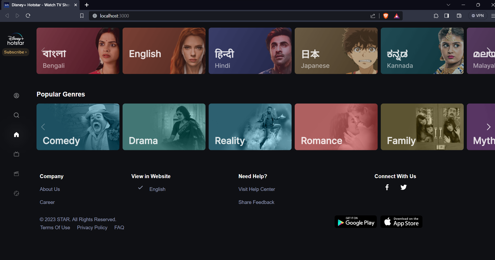

# DisneyHotstar-Clone
Disney+ Hotstar Clone using React

I attended an amazing Workshop to Clone Frontend of <a href="https://www.hotstar.com/in/home">Disney+Hotstar</a> using REACT by GDSC SIESGST and here's the clone!

# Steps after cloning or downloading:
Open your Terminal in Cloned path or Extrtacted file path

Do : 
 
`
npm start
`

If not working run these commands :
 
`
npm i
`
 
`
npm i styled-components
`
 
`
npm i react-icons
`
 
`
npm i box-icons
`
 
`
npm i swiper
`
 
`
npm start
`

# Preview

